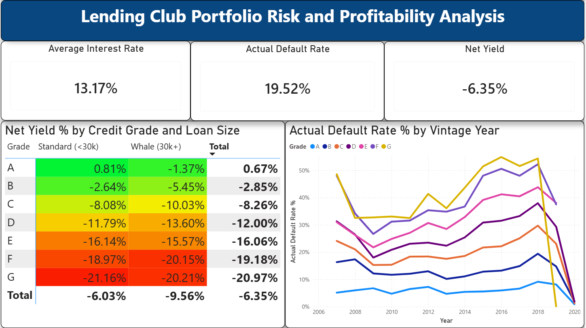

# Lending Club Portfolio Risk and Profitability Analysis

### Executive Summary

This project analyzes Lending Club loan data to evaluate the relationship between credit risk and portfolio returns. Using Power BI, I modeled estimated net yield by incorporating a Loss Given Default (LGD) assumption.

At a 70% LGD, the portfolio produces an estimated net yield of -1.15%, with lower credit grades driving negative performance.

### Technical Stack
* Python (Google Colab): Data filtering, feature engineering, and aggregation from a 2.9M-row dataset
* Power BI (DAX): Volume-weighted measures for interest rate, default rate, and estimated net yield
* Power BI Visualization: Interactive dashboard with LGD sensitivity analysis

### Methodology
* Filtered dataset to completed loan outcomes (Fully Paid, Charged Off, Default)
* Calculated default rate and average interest rate by segment
* Aggregated data by Grade, Term, Year, Loan Size, and FICO bucket
* Modeled return using: Estimated Net Yield = Interest Rate − (Default Rate × LGD)
* Applied volume-weighting to better reflect portfolio-level impact
* Implemented an LGD slicer to test different loss assumptions

### Insights

**Risk-Return Imbalance**
* At a 70% LGD assumption, most credit grades produce negative estimated returns, despite relatively high interest rates.

**Credit Grade Impact**
* Grade A loans are near breakeven or slightly positive
* Grades B–G trend negative, with losses increasing in lower-quality segments

**Loan Size (Whale Risk)**
* Loans above $30,000 tend to underperform or amplify losses, highlighting the impact of exposure size on portfolio risk.

**Sensitivity to Loss Assumptions**
* Returns are highly sensitive to LGD.
* Increasing LGD assumptions leads to significantly worse portfolio performance, reinforcing the importance of loss severity in lending models.

